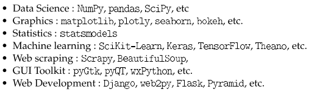

# Installing Libraries using pip

## Introduction

[Pip](https://pip.pypa.io/en/stable/) is a package manager for Python that allows you to easily install and manage third-party libraries and packages. In this guide, we'll walk you through the steps to install the `numpy`, `pandas`, and `matplotlib` libraries using `pip`.

## Installation Steps

### 1. Open a Terminal

- On Windows: Press `Win + R`, type `cmd`, and press Enter.
- On macOS and Linux: Search for the Terminal application in your applications.

### 2. Check Pip Version (Optional) then Install

Before installing any packages, it's a good idea to check if you have `pip` installed and which version you have:


```sh
pip --version
```
Install numpy
```sh
pip install numpy
```
Install pandas
```sh
pip install pandas
```
Install matplotlib
```sh
pip install matplotlib
```
### 3. Verification
You can verify that the libraries are installed correctly by running Python in your terminal:

```sh
python
```
Then, within the Python interpreter, try importing each library:
```python
import numpy
import pandas
import matplotlib
```
## More of Libraries
